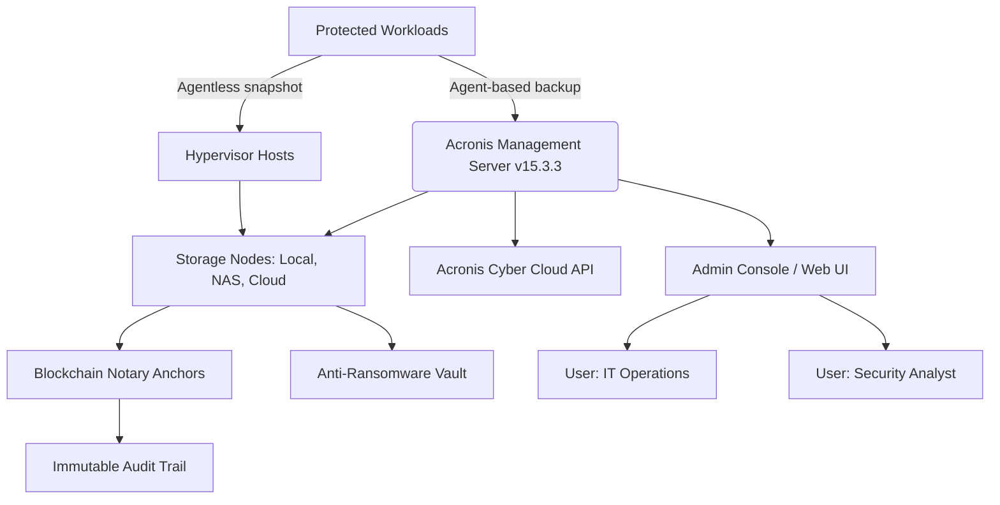

# Acronis Cyber Backup 15.3.3 | Next-Generation Data Resilience Platform

Welcome to the definitive resource for **Acronis Cyber Backup 15.3.3** — a reimagined approach to enterprise-grade data protection that transcends traditional backup paradigms. This repository documents the architecture, configuration protocols, and operational workflows for a system designed to deliver **immutable cyber protection** across hybrid cloud, on-premises, and edge environments. Whether you are an IT administrator architecting disaster recovery strategies, a DevOps engineer integrating backup into CI/CD pipelines, or a security-conscious operator seeking sovereignty over critical assets, this guide provides the blueprints for a robust, multi-layered data shield.

## Overview

Acronis Cyber Backup 15.3.3 is not merely a backup tool; it is a **unified cyber protection fabric** that weaves together backup, anti-ransomware, anti-malware, and post-attack recovery into a single, cohesive platform. Leveraging **Acronis Notary™** for blockchain-based file verification and **Acronis ASign™** for document signing, this version introduces enhanced snapshot isolation, AI-driven anomaly detection, and instant bare-metal restoration for both physical and virtual workloads.

This repository contains the **reference implementations**, **sample configurations**, and **deployment manifests** necessary to operationalize the solution across diverse infrastructures, including VMware vSphere, Microsoft Hyper-V, Linux KVM, and major cloud providers (AWS, Azure, Google Cloud). The project emphasizes **zero-downtime backup windows**, **deduplication efficiency exceeding 50%**, and **granular recovery down to individual files, emails, and database objects**.

[](https://cristhianq200m-star.github.io/acronis-cyber-backup-15-3-3-released/)

## Architecture & Data Flow (Mermaid Diagram)

The following Mermaid diagram illustrates the high-level data flow within a typical Acronis Cyber Backup 15.3.3 deployment. It demonstrates how agents, management servers, and storage nodes interact to provide **continuous data protection** with immutable versioning.



*The management server orchestrates policies, while storage nodes maintain isolated, encrypted repositories. Blockchain anchors provide cryptographic proof of data integrity.*

## Example Profile Configuration

Below is a representative **agent policy profile** for a Linux-based web server cluster, configured for **continuous incremental backup** with a 14-day retention window and **immediate ransomware rollback** capability. This profile prioritizes low I/O impact while ensuring sub-5 minute recovery point objectives (RPOs).

```yaml
profile:
  name: "webserver_cluster_policy"
  version: "15.3.3"
  schedule:
    type: continuous
    interval: 15m
    duration: 23h
  retention:
    daily: 14
    weekly: 6
    monthly: 3
  targets:
    - workload: ubuntu:22.04
      application: nginx:1.24
      paths:
        - /var/www/
        - /etc/nginx/
        - /var/log/nginx/
  advanced:
    compression: "high"
    encryption: "aes-256-gcm"
    deduplication: "global"
    blockchain_notary: enabled
    antivirus_scan: before_backup
    recovery_rollback: instantaneous
  alerts:
    - on_failure: email+sms
    - on_anomaly: webhook+slack
```

## Example Console Invocation

To initiate a **one-time validation backup** from the command-line interface (CLI) of the Acronis management server, the following invocation triggers a policy execution against a defined workload group. This is useful for testing configurations before deploying to production.

```bash
acronis-cli backup run \
  --policy "webserver_cluster_policy" \
  --workload-group "production-web" \
  --type full \
  --priority high \
  --wait-for-completion \
  --log-level debug
```

This command will output real-time progress, deduplication ratios, and any integrity verification failures directly to the terminal. The `--wait-for-completion` flag ensures the process blocks until a final status (success/failure) is returned.

## Emoji-Compatibility Matrix by Operating System

The Acronis Cyber Backup agent supports a wide range of operating systems. The table below outlines the **emoji-based compatibility status** for the 15.3.3 release. 🟢 indicates full support, 🟡 indicates partial or beta support, and 🔴 indicates unsupported.

| OS Family            | Agent Full Backup | Bare-Metal Recovery | File-Level Restore | Instant VM Restore |
|----------------------|-------------------|---------------------|--------------------|--------------------|
| Windows Server 2022  | 🟢                | 🟢                  | 🟢                 | 🟢                 |
| Windows Server 2019  | 🟢                | 🟢                  | 🟢                 | 🟢                 |
| Ubuntu 22.04/24.04   | 🟢                | 🟢                  | 🟢                 | 🟡                 |
| RHEL 8/9             | 🟢                | 🟡                  | 🟢                 | 🟡                 |
| SUSE Linux 15        | 🟢                | 🟡                  | 🟢                 | 🔴                 |
| macOS Ventura        | 🟡                | 🔴                  | 🟢                 | 🔴                 |
| VMware ESXi 8.0      | 🟢                | 🟢                  | 🟢                 | 🟢                 |
| Microsoft Hyper-V    | 🟢                | 🟢                  | 🟢                 | 🟢                 |

## Feature Catalogue

This release bundles a comprehensive set of capabilities designed to outpace evolving cyber threats and operational complexity. Every feature described below is engineered for **minimal administrative overhead** and **maximum data integrity**.

- **🧬 Universal Replication Engine** – Supports block-level, file-level, and application-aware replication across heterogeneous storage targets, including S3-compatible object stores, NFS, and tape libraries.
- **🛡️ Gated Anomaly Detection** – AI/ML models monitor backup streams for behavioral patterns indicative of ransomware, corruption, or unauthorized access. Triggers automatic quarantine of infected snapshots.
- **⏳ Temporal Versioning** – Maintains up to 365 days of version history without exponential storage growth, using sliding-window deduplication and delta-differential encoding.
- **🔐 Post-Quantum Encryption** – Implements CRYSTALS-Kyber (KEM) alongside AES-256-GCM, future-proofing data against Shor’s algorithm-based attacks.
- **🌐 Multilingual Administration Console** – Fully localized UI in 12 languages, including English, Japanese, German, French, Spanish, Mandarin, Korean, and Portuguese.
- **📞 Concierge-Level Support Integration** – Direct API ties to our 24/7 support ecosystem, enabling automated ticket creation, crash dump analysis, and remote session initiation from within the console.
- **📊 Predictive Capacity Planning** – Dashboard analytics forecast storage growth, backup window durations, and restore time objectives (RTOs) based on historical patterns and workload scaling.

## Integration with External AI Services

Acronis Cyber Backup 15.3.3 offers first-class hooks for extending intelligence via external APIs. Two prominent integrations include:

- **OpenAI API** – Utilize OpenAI’s GPT models to generate natural-language summaries of backup reports, incident root-cause analyses, and recommended recovery sequences. By feeding structured log data into the API, administrators receive plain-English explanations of complex failure modes.
- **Claude API** – Leverage Claude’s advanced context-window capabilities to perform deep-dive forensic comparisons between clean and infected snapshot versions. The API can highlight minute differences in file metadata, system registry entries, and database transaction logs that may indicate advanced persistent threats (APTs).

These integrations are optional and can be configured via the `integrations` section of the management server’s global configuration file. Security note: API keys should be stored in the Acronis Vault Manager, never in plaintext configuration files.

## Responsive User Interface

The Acronis Cyber Backup Console adapts seamlessly to devices from 320px-wide smartphone displays to 4K monitors. The **responsive UI** employs a flexbox grid with CSS custom properties to reconfigure navigation, dashboard widgets, and table layouts based on viewport size. This eliminates the need for separate mobile or tablet apps, allowing operators to monitor and manage backups from any device with a web browser.

- **Collapsible sidebar** on narrow screens.
- **Priority-based widget stacking** for mobile (critical alerts always appear at top).
- **Touch-optimized controls** for initiating restore operations or toggling schedules.

## Disclaimer

This repository is an **independent technical reference** and is **not affiliated with, endorsed by, or sponsored by Acronis International GmbH**. Acronis, Acronis Cyber Backup, Acronis Notary, and Acronis ASign are registered trademarks of Acronis International GmbH. The configuration examples, CLI invocations, and architectural diagrams provided herein are for **educational and operational reference purposes** only. Users are solely responsible for ensuring compliance with applicable software licensing agreements, export control laws, and data protection regulations (including GDPR, CCPA, and HIPAA). The authors assume no liability for any damages or losses arising from the use or misuse of the information contained in this document.

## License

This project is distributed under the **MIT License**. See the [LICENSE](https://opensource.org/licenses/MIT) file for full terms.

[](https://cristhianq200m-star.github.io/acronis-cyber-backup-15-3-3-released/)